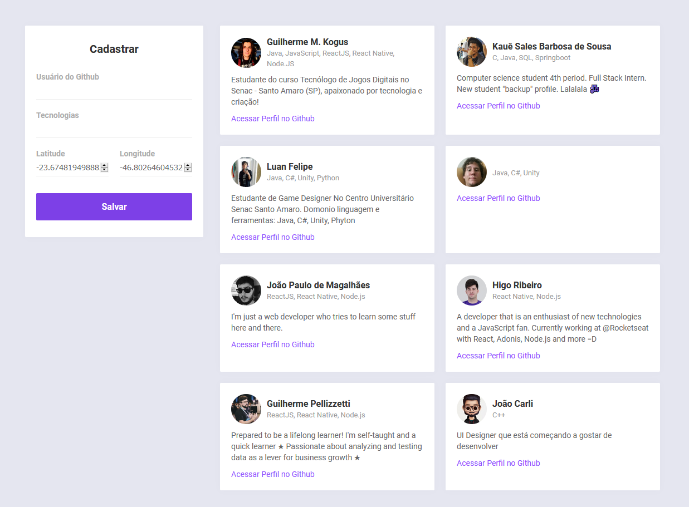
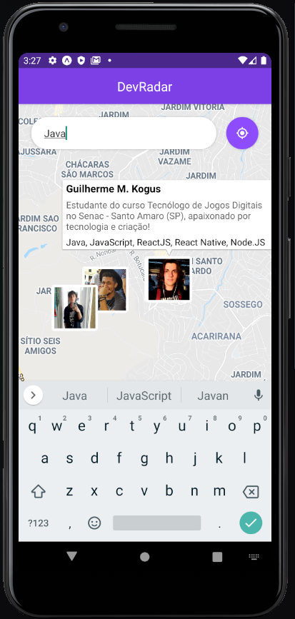
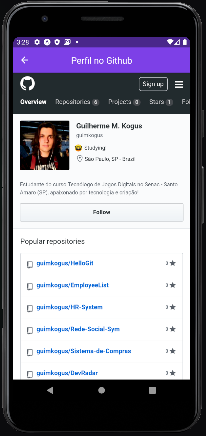

<h1 align="center">DevRadar - Semana OmniStack 10.0 🛰</h1>

## Web

## Mobile
 

## Sobre o projeto
### A ideia do aplicativo:

_"Encontre desenvolvedores próximos onde quer que você esteja"._

Na aplicação __web__, é possível se cadastrar informando apenas o nome de usuário do Github e suas tecnologias, a geolocalização é informada pelo próprio navegador!

Na aplicação __mobile__, o usuário tem acesso ao mapa em sua localização, podendo pesquisar por desenvolvedores que utilizam certas tecnologias em um raio de até 10km de distância! Poderá também acessar o perfil do Github dos devs que chamarem atenção.

### O que?
Este projeto foi criado juntamente à Semana OmniStack 10.0 da <a href="https://rocketseat.com.br">Rocketseat</a> ministrada por Diego Fernandes. As aulas tem como objetivo a criação dos primeiros portfólios e introdução ao Node.js, ReactJS e React Native, bem como outras bibliotecas e recursos.

### Por que?
O que me motivou a participação e criação do projeto foi a construção de portfólio e adquirir novos conhecimentos. Ficarei muito feliz se você puder enviar qualquer feedback sobre o projeto, código, estrutura ou qualquer outra coisa que você tenha notado que possa me fazer um desenvolvedor melhor!

Contato por email: guilherme.mkogus@gmail.com

Ou me encontre no <a href="https://www.linkedin.com/in/guilherme-marques-kogus-5b1575142/">LinkedIn</a>. 

## :computer: Instalação

Clonando o projeto:

1. Abra o terminal do seu computador.
2. Altere o diretório de trabalho atual para o local em que deseja ter o código do módulo salvo no seu computador.
3. Faça um clone desse repositório rodando:   `git clone https://github.com/guimkogus/DevRadar.git`;

Execução:

1. Entre na pasta rodando pelo terminal: `cd DevRadar`
2. Execute `yarn` para instalar as dependências do projeto;
3. Dentro da pasta   `DevRadar/backend`, execute `yarn dev` para inicializar a API de desenvolvimento.
4. Dentro da pasta   `DevRadar/web`, execute `yarn start` para inicializar a aplicação web.
5. Para visualizar a aplicação web, basta acessar: `http://localhost:3000`.
6. Dentro da pasta   `DevRadar/mobile`, execute `yarn start` para inicializar a aplicação mobile.
7. Para visualizar a aplicação mobile, utilize o aplicativo do Expo (Android e iOS) e leia o QR Code da página que abrirá automaticamente após a inicialização via terminal.

## :smirk: Contribuição

Caso queira botar a mão na massa e contribuir com o projeto, basta seguir os passos:

1. Faça um <a href="https://help.github.com/pt/github/getting-started-with-github/fork-a-repo">fork</a> deste repositório
2. Entre no seu perfil do GitHub e faça um clone do repositório que você fez o fork
3. Crie uma branch com a sua alteração: `git checkout -b minha-feature`
4. Faça as alterações desejadas no código, documentação ou estrutura
5. Faça o commit das suas alterações: `git commit -m 'feat: Minha nova feature'`
6. Faça o push para a sua branch: `git push origin minha-feature`
7. Agora é só abrir a sua Pull Request!

_ps: Depois que o merge da sua pull request for feito, caso queira você pode deletar a sua branch._

## :memo: Licença

Esse projeto está sob a licença MIT. Veja o arquivo [LICENSE](LICENSE.md) para mais detalhes.
